 

The Shoebox Project is a non-profit company whose purpose is to provide professional photographs and memories for children in the foster care system. 


#### URL
[The Shoebox Project](https://www.shoeboxproject.valeriethoma.com)

## Features

- [About](#about)
- [Project Blog](#project-blog)
- [Interactive Map](#interactive-map)
- [Volunteer Registration](#volunteer-registration) 
- [User Login and Home Page](#user)
- [Volunteer Login and Home Page](#volunteer)
- [Admin Dashboard](#admin-dashboard)
- [Contact](#contact) 
- [FAQ](#faq)

## About

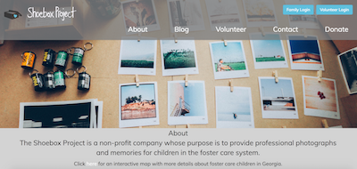

## Project Blog

**Visiters to the site can read `blogs` written by administrators or volunteers.**

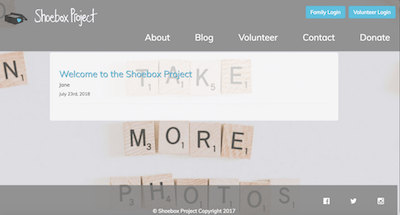


**All volunteers can author blogs but only the admin can `approve` them. Blogs can also be retroactively `hidden`.**

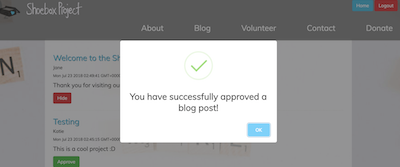

## Interactive Map

**`Hover` over this interactive map to see how many children are in active foster care per county, or find the county you are looking for in the `search` bar.**

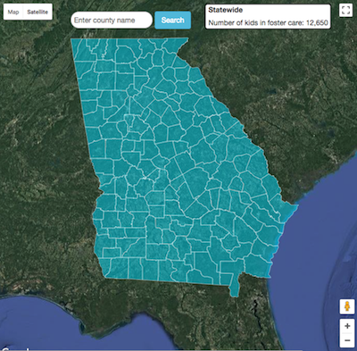 

## Volunteer Registration


**Once a volunteer has `registered`, they will be contacted by the administrator. 
After both a phone interview and an in-person interview, the volunteer must submit to a comprehensive background check prior to being onboarded and `given access to the volunteer login portal`.**


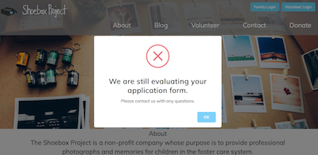

## User Login and Home Page

**The administrator will create a home page for each user, i.e. the child in foster care. The user will have input on how they would like their home page to look. Currently there is one theme, but additional themes are coming. The user will also select a cover image for their photo album.**

> Shyla
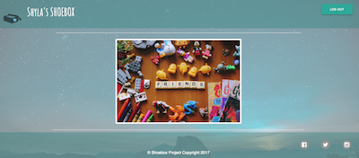
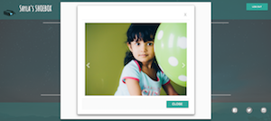

> Henry 
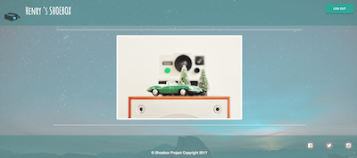
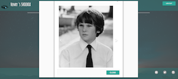


     Loging in as Jackson
    
- visit [https://shoeboxproject.valeriethoma.com/](https://shoeboxproject.valeriethoma.com/)
- click `Family Login`
- enter email: `jackson@mail.com`, password: `jackson`
- browse user photos


## Code snippets

A route for 'blog home' checks the database against user permissions. If a user is admin, permission to publish or hide is granted. All approved blog posts are rendered.
``` javascript
router.get('/blog', function(req, res, next) {
    var approved = false;
    var hidden = false;
    var notAdmin = false;
    var review = false;
    if(req.query.msg == 'blogReview' || req.query.msg == 'blogReviewApproved' || req.query.msg == 'blogReviewHidden'){
        if(req.session.privileges == 3){
            review = true;
        }else{
            notAdmin = true;
        }
    }
    if(req.query.msg == 'blogReviewApproved'){
        approved = true;
    }
    if(req.query.msg == 'blogReviewHidden'){
        hidden = true;
    }
    if(review){ // Administrator privileges -- will see ALL blogs
        var selectQuery = `SELECT * FROM blog ORDER BY blog_id DESC;`;
    }else{ // Anyone else will only see approved blogs
        var selectQuery = `SELECT blog_id, title, DATE_FORMAT(date, '%M %D\, %Y') as date, body, name, approved FROM blog WHERE approved = "yes" ORDER BY blog_id DESC;`;
    }
    connection.query(selectQuery, (error, results)=>{
        if(error){
            throw error;
        }
        res.render('blog',{
            review: review,
            notAdmin: notAdmin,
            blog: results,
            approved: approved,
            hidden: hidden
        });    
    });
});
```
Using express-session middleware and the Node.js package Bcrypt, users are logged-in.  
``` javascript
   router.post('/loginProcess', (req, res, next)=>{
    var email = req.body.email;
    var password = req.body.password;
    var selectQuery = `SELECT * FROM users WHERE email = ?;`;
    connection.query(selectQuery, [email], (error, results)=>{
        if(error){
            throw error;
        }
        if(results.length == 0){
            res.redirect('/users/login?msg=notRegistered');
        }else{
            var passwordsMatch = bcrypt.compareSync(password, results[0].password);
            if(passwordsMatch){
                var row = results[0];
                req.session.name = row.first_name;
                req.session.uid = row.id;
                req.session.email = row.email;
                res.redirect('/users/home?msg=loggedIn');
            }else{
                res.redirect('/users/login?msg=badPass');
            }
        }
    });
});
```
From the Administrator's dashboard, those with permissions can upload photos and add comments to the volunteers' profiles. Eddie wrote this sick-ass Left Join and I'm hella envious.  
``` javascript
router.get('/userReview', (req, res)=>{
    var numPhotos = -1;
    if(Number(req.query.msg) != NaN){
        var numPhotos = Number(req.query.msg);
    }
    var commentsAdded = false;
    if(req.query.msg == 'commentsAdded'){
        commentsAdded = true;
    }
    var commentsReplaced = false;
    if(req.query.msg == 'commentsReplaced'){
        commentsReplaced = true;
    }
    var selectQuery = `SELECT * 
        FROM users
        LEFT JOIN (
            SELECT images.id, images.img_id, images.url, images.date_uploaded, images.vol_id
            FROM (
                SELECT id, MIN(img_id) as minId 
                FROM images GROUP BY id
            ) AS x INNER JOIN images ON images.id = x.id AND images.img_id = x.minId
        ) AS images ON users.id = images.id ORDER BY users.id;`;
    connection.query(selectQuery, (error, results)=>{
        if(error){
            throw error;
        }
        res.render('admin-dashboard-users', {
            numPhotos: numPhotos,
            volunteerId: req.session.uid,
            commentsAdded: commentsAdded,
            commentsReplaced: commentsReplaced,
            users: results
        });
    });
});

```
## Screenshots
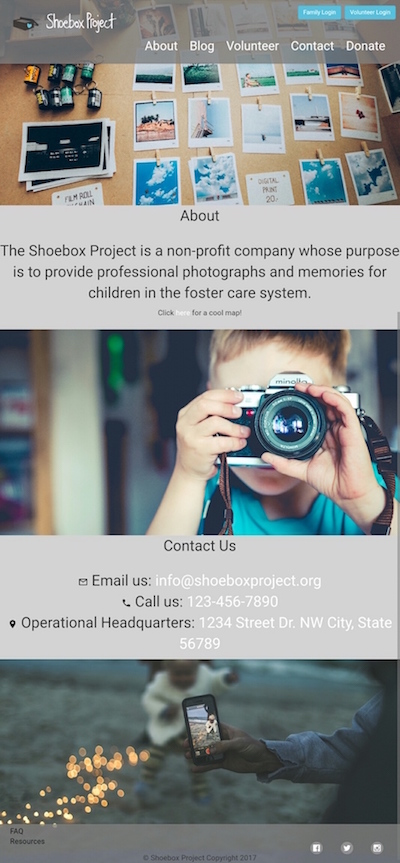

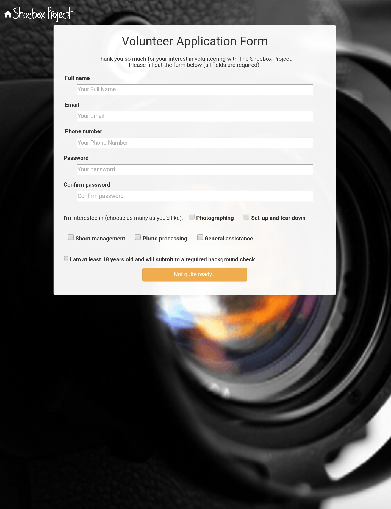
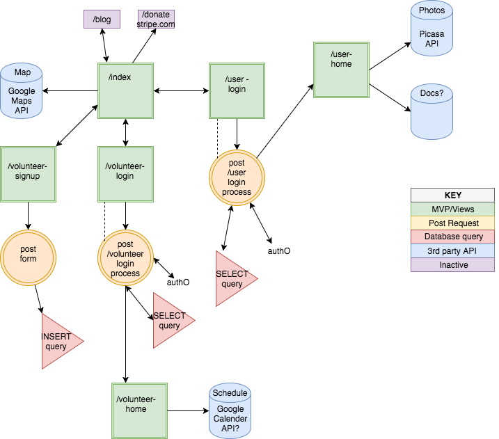

## Authors
* [Eddie Atkinson](https://github.com/eddieatkinson)
**Scrum Master|Route Layer|Data Wrangler|Map Magician|Developer**
* [Valerie Jane Thoma](https://github.com/ValerieThoma)
**Route Layer|Designer|Class Clown|Developer**
* [Amir Patel](https://github.com/Amirpatel89)
**Route Layer|Mobile Responsive Resuscitator|New Kid on the Block|Developer**


## Technologies used
**Languages:**
* JavaScript
* HTML5
* CSS

**Frameworks and Libraries:**
* Express
* Node.js
* jQuery
* Bootstrap

**Other:**
* MySQL
* AWS S3
* Google Maps API
* Multer
* Multer S3
* Bcrypt
* Adobe XD - wireframe

## All updated changes to Shoebox Project will be hosted at
[The Shoebox Project](https://myshoeboxproject.org) 
c/o Eddie and Crystal Atkinson, founders and operators of Ella B. Phtography & The Shoebox Project 

## Project Created
10/18/2017 

## Improvements 
- 👩🏽‍🔬Testing to begin shortly with Cypress
- UI updates coming soon 🎀
