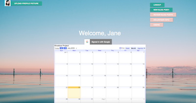
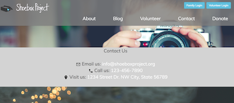
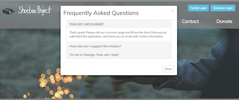
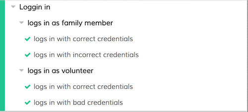
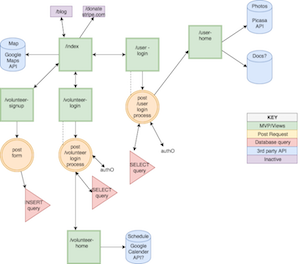
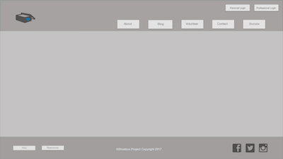

 

The Shoebox Project is a non-profit company whose purpose is to provide professional photographs and memories for children in the foster care system. 


#### URL
[The Shoebox Project](https://shoeboxproject.valeriethoma.com/)

## Features

- [About](#about)
- [Project Blog](#project-blog)
- [Interactive Map](#interactive-map)
- [Volunteer Registration](#volunteer-registration) 
- [User Login and Home Page](#user-login-and-home-page)
- [Volunteer Login and Home Page](#volunteer-login-and-home-page)
- [Admin Dashboard](#admin-dashboard)
- [Contact](#contact) 
- [FAQ](#faq)
- [Tests!](#tests)
- [More to Come](#improvements)

## About


## Project Blog

**Visiters to the site can read `blogs` written by administrators or volunteers.**


**All volunteers can author blogs but only the admin can `approve` them. Blogs can also be retroactively `hidden`.**


## Interactive Map

**`Hover` over this interactive map to see how many children are in active foster care per county, or find the county you are looking for in the `search` bar.**

 

## Volunteer Registration


**Once a volunteer has `registered`, they will be contacted by the administrator. 
After both a phone interview and an in-person interview, the volunteer must submit to a comprehensive background check prior to being granted access to the `volunteer login portal`.**


## User Login and Home Page

**The administrator creates a `home page` for each user/child. The user has input on the appearance of their home page. Currently there is one `theme`, but additional themes will be added. The user also selects a `cover image` for their photo album.**

     Shyla


     Henry


     Logging in as Jackson
    
- visit [https://shoeboxproject.valeriethoma.com/](https://shoeboxproject.valeriethoma.com/)
- click `Family Login`
- enter email: `jackson@mail.com`, password: `jackson`
- browse user photos

## Volunteer Login and Home Page


**Once `approved` by the site admin, volunteer photographers are given a `login`.**

**The volunteer home page features links to:**
- upload a profile picture
- sign into Google Calander
     - view upcoming photo shoots
     - update availability
- compose a blog post
     


## Admin Dashboard



**`Admins` of site have all the same features as volunteers with `levels 1 and 2` access.**
<br>
**In addition, admins have `level 3` access:**
- review blog posts
- view and edit volunteer profiles:
     - approve volunteers
     - assign permissions
     - leave notes 
- view and edit user information:
     - upload photos
     - view photos
     - leave notes
     
## Contact 

**Want to get involved? Contact us.**


<br>
_placeholder contact information given_

## FAQ

**We know you have questions.**



## Tests

_Everybody loves tests, right?!?!_ 🙄

**1) Test your login through the UI**



```js
// cy.visit(before each test)

describe("Loggin in", () => {
  beforeEach(() => {
    cy.visit("/") //set baseUrl to localhost:3001
  });
  
```


```js
     
  // login in with an authenticated user   
  context("logs in as family member", () => {
    it("logs in with correct credentials", () => {
      cy.get("[data-cy=familyLogin]")
        .click({force:true})

      cy.get("[data-cy=userEmail]")
        .type("shyla@mail.com")

      cy.get("[data-cy=userPass")
        .type("shyla")
      
      cy.get("[data-cy=userSubmit]")
        .click()  

      cy.location("pathname").should("eq", "/users/home")  

  });
     
    // check validations
    it("logs in with incorrect credentials", () => {
      cy.get("[data-cy=familyLogin]")
        .click({ force: true })

      cy.get("[data-cy=userEmail]")
        .type("shyla@mail.com")

      cy.get("[data-cy=userPass")
        .type("wrongpassword")

      cy.get("[data-cy=userSubmit]")
        .click()

      // sweet alert tells user they have entered the wrong password  
      cy.get(".swal-modal")
        .should('exist')
      
      cy.get(".swal-title")
        .should("contain", "Your password is incorrect")

      // after entering wrong password, the user remains on the login page
      cy.location("pathname").should("eq", "/users/login")  
    });

  });

```

**Keep your tests reliable with data-cy attributes instead of coupling them with class names that may change during production.** 

## Screenshots

     Mobile View
     


     Early Planning
     


     Wire Frames




## Authors
* [Eddie Atkinson](https://github.com/eddieatkinson)
**Scrum Master|Route Layer|Data Wrangler|Map Magician|Developer**
* [Valerie Jane Thoma](https://github.com/ValerieThoma)
**Route Layer|Designer|Class Clown|Developer**
* [Amir Patel](https://github.com/Amirpatel89)
**Route Layer|Mobile Responsive Resuscitator|New Kid on the Block|Developer**


## Technologies used
**Languages:**
* JavaScript
* HTML5
* CSS

**Frameworks and Libraries:**
* Express
* Node.js
* jQuery
* Bootstrap

**Other:**
* MySQL
* AWS S3
* Google Maps API
* Multer
* Multer S3
* Bcrypt
* Adobe XD - wireframe

## All updated changes to Shoebox Project will be hosted at
[The Shoebox Project](https://myshoeboxproject.org) 
c/o Eddie and Crystal Atkinson, founders and operators of Ella B. Phtography & The Shoebox Project 

## Project Created
10/18/2017 

## Improvements 
- `Donate` link to accept `Stripe` payments 😇
- 👩🏽‍🔬More UI and API `tests` with [Cypress](https://www.cypress.io/)
- UI updates coming soon 🎀
