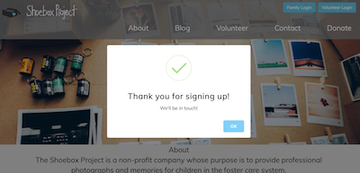

 

The Shoebox Project is a non-profit company whose purpose is to provide professional photographs and memories for children in the foster care system. 

#### URL
[The Shoebox Project](https://www.shoeboxproject.valeriethoma.com)

## Features

- [About](#about)
- [Project Blog](#project-blog)
- [Interactive Map](#interactive-map)
- [Volunteer Registration](#volunteer-registration) 
- [User Login and Home Page](#user-login-and-home-page)
- [Volunteer Login and Home Page](#volunteer-login-and-home-page)
- [Admin Dashboard](#admin-dashboard)
- [Contact](#contact) 
- [FAQ](#faq)

## About

## Project Blog

**Visiters to the site can read `blogs` written by administrators or volunteers.**

**All volunteers can author blogs but only the admin can `approve` them. Blogs can also be retroactively `hidden`.**

## Interactive Map

**`Hover` over this interactive map to see how many children are in active foster care per county, or find the county you are looking for in the `search` bar.**

 

## Volunteer Registration

**Once a volunteer has `registered`, they will be contacted by the administrator. 
After both a phone interview and an in-person interview, the volunteer must submit to a comprehensive background check prior to being onboarded and `given access to the volunteer login portal`.**

## User Login and Home Page

**The administrator will create a `home page` for each user, i.e. the child in foster care. The user will have input on how they would like their home page to look. Currently there is one `theme`, but additional themes are coming. The user will also select a `cover image` for their photo album.**

     Shyla

     Henry

     Logging in as Jackson
    
- visit [https://shoeboxproject.valeriethoma.com/](https://shoeboxproject.valeriethoma.com/)
- click `Family Login`
- enter email: `jackson@mail.com`, password: `jackson`
- browse user photos

## Volunteer Login and Home Page

**Once approved by the site admin, volunteer photographers are given a login.**

**The volunteer home page features links to:**
- upload a profile picture
- sign into Google Calander
- compose a blog post
     

## Screenshots

## Authors
* [Eddie Atkinson](https://github.com/eddieatkinson)
**Scrum Master|Route Layer|Data Wrangler|Map Magician|Developer**
* [Valerie Jane Thoma](https://github.com/ValerieThoma)
**Route Layer|Designer|Class Clown|Developer**
* [Amir Patel](https://github.com/Amirpatel89)
**Route Layer|Mobile Responsive Resuscitator|New Kid on the Block|Developer**

## Technologies used
**Languages:**
* JavaScript
* HTML5
* CSS

**Frameworks and Libraries:**
* Express
* Node.js
* jQuery
* Bootstrap

**Other:**
* MySQL
* AWS S3
* Google Maps API
* Multer
* Multer S3
* Bcrypt
* Adobe XD - wireframe

## All updated changes to Shoebox Project will be hosted at
[The Shoebox Project](https://myshoeboxproject.org) 
c/o Eddie and Crystal Atkinson, founders and operators of Ella B. Phtography & The Shoebox Project 

## Project Created
10/18/2017 

## Improvements 
- 👩🏽‍🔬Testing to begin shortly with Cypress
- UI updates coming soon 🎀
